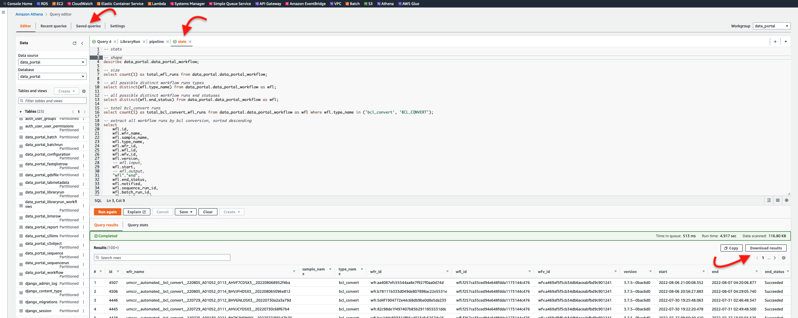

# Portal Athena

We have also setup Data Portal as Athena Data Catalog. You can use few SQL queries to tap directly into the Portal database.

You need to be part of AWS Power User group i.e. able to assume role `ProdOperator`.

> Portal Athena Data Catalog is available as **READ ONLY** mode.

### Step 1

- Go to AWS [Athena Console](https://ap-southeast-2.console.aws.amazon.com/athena/home?region=ap-southeast-2#/landing-page)
- Click "Query editor"

### Step 2

- At top right corner, drop down and select "data_portal"

### Step 3

- When prompt, click "Acknowledge" button

### Step 4

- At left navigation Data source, dropdown to select "data_portal"

### Step 5

- At Database dropdown, select "data_portal"

### Step 6

- Next, highlight the query and click "Run"

### Step 7

- You can save and load the "Named Query" from _Saved Queries_ tab.
- Highlight each query statement block (if multilines) and click "Run".
- You can download the results by "Download Results" button.

## Next

Please have a look some `*.sql` in this directory. 

Most of these scripts should be there in Athena Console as saved Named Query (i.e. `Saved queries` tab).

## Data Model

See [../model/data_portal_model.pdf](../model/data_portal_model.pdf)

## CLI

See [README_CLI.md](README_CLI.md)

## Programmatic

### R

- cloudyr
  - https://github.com/cloudyr/aws.athena
- Paws
  - https://paws-r.github.io/docs/athena/
- RAthena 
  - https://github.com/DyfanJones/RAthena
  - https://www.r-bloggers.com/2019/09/athena-and-r-there-is-another-way/
- noctua 
  - https://github.com/DyfanJones/noctua
- rJava/RJDBC
  - https://github.com/s-u/rJava
  - https://aws.amazon.com/blogs/big-data/running-r-on-amazon-athena/
  - https://developer.ibm.com/tutorials/athena-goes-r-how-to-handle-s3-object-storage-queries-from-r/
- DBI/ODBC
  - See [RStudio](RStudio)

### Python

- Boto3
- https://aws-data-wrangler.readthedocs.io/en/stable/index.html
- https://awstip.com/how-to-query-your-s3-data-lake-using-athena-within-an-aws-glue-python-shell-job-491c00af8867

### GA4GH Data Connect API

_i.e. querying in more Genomics specific standardised way_

- WIP, see https://github.com/umccr/data-portal-apis/issues/452

## Notes

- Athena is based on [PrestoDB](https://prestodb.io)/[Trino](https://trino.io) query engine. Not 100% native SQL.
- Athena is Serverless AWS managed service. If no use, no charges. Otherwise, it prices at [$5 per TB data scan](https://aws.amazon.com/athena/pricing/?nc=sn&loc=3).
- There are some feature parity between Athena and PrestoSQL. But. Those were mainly on advanced use cases. Most typical analytic query should support it.
