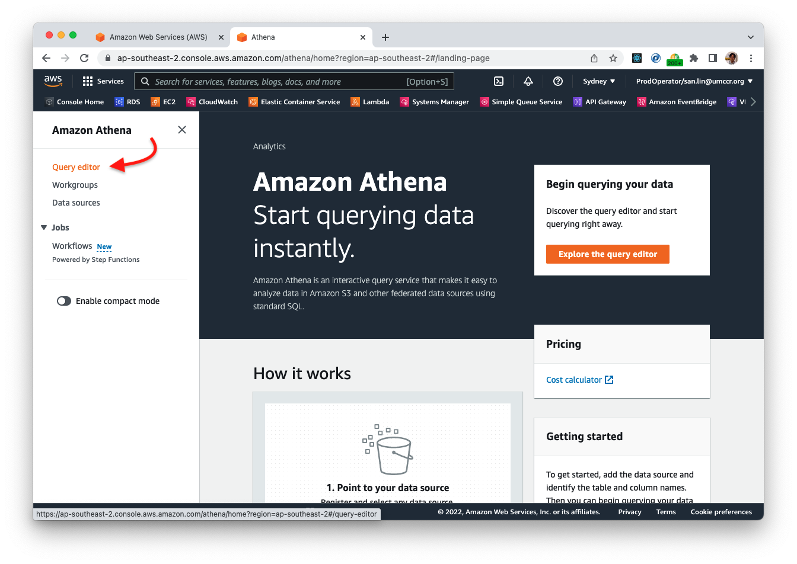
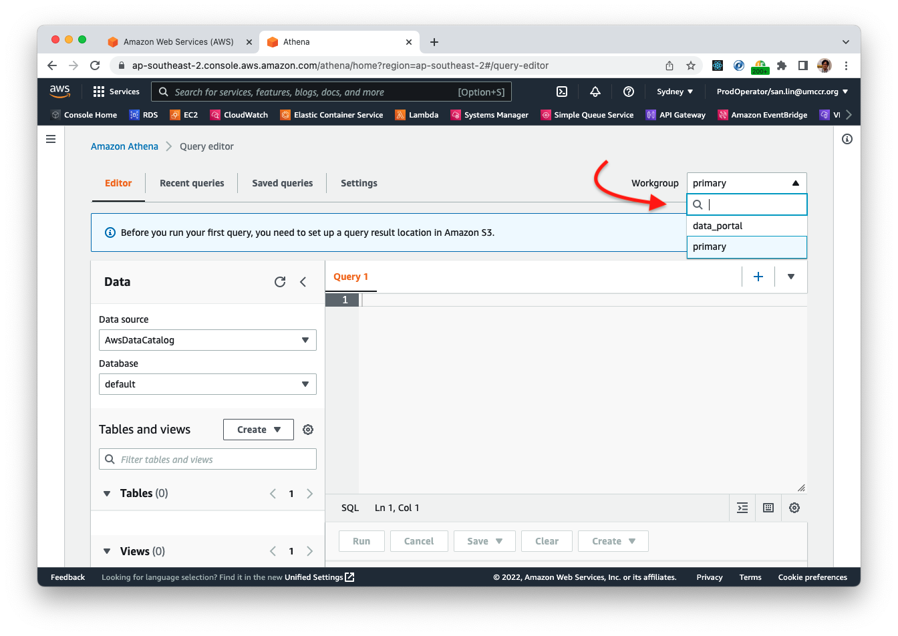
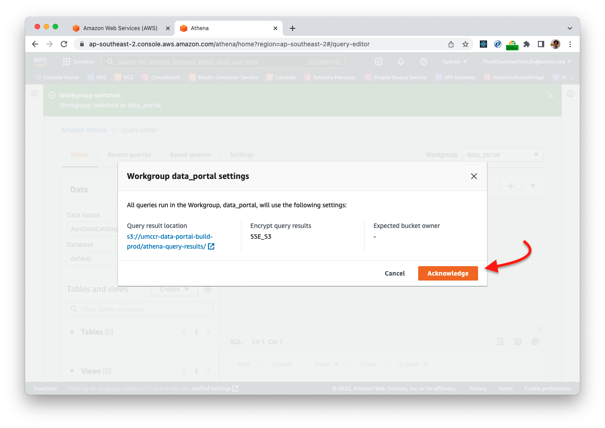
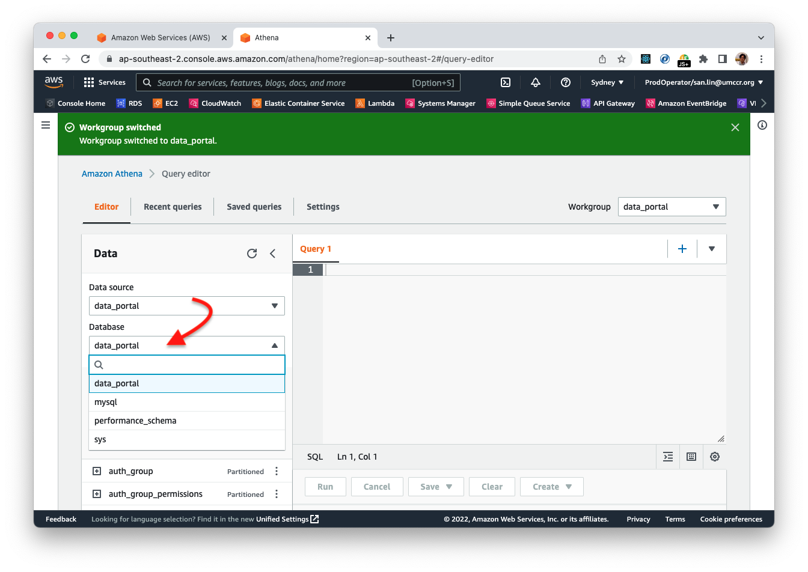
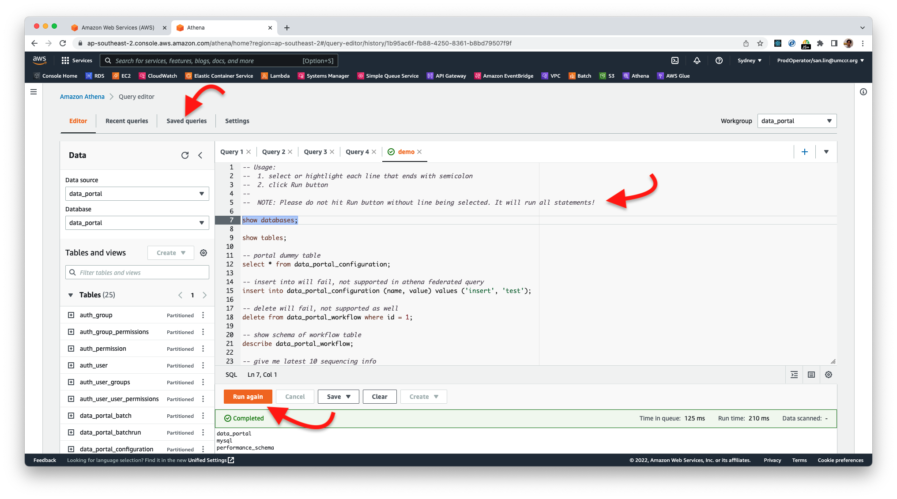

# Portal Athena

We have also setup Data Portal as Athena Data Catalog. You can use few SQL queries to tap directly into the Portal database.

You need to be part of AWS Power User group i.e. able to assume role `ProdOperator`.

> Portal Athena Data Catalog is available as **READ ONLY** mode.

### Step 1

- Go to AWS [Athena Console](https://ap-southeast-2.console.aws.amazon.com/athena/home?region=ap-southeast-2#/landing-page)
- Click "Query editor"

### Step 2

- At top right corner, drop down and select "data_portal"

### Step 3

- When prompt, click "Acknowledge" button

### Step 4

- At left navigation Data source, dropdown to select "data_portal"

### Step 5

- At Database dropdown, select "data_portal"

### Step 6

- At Database dropdown, select "data_portal"

## Next

Please have a look some `*.sql` in [Example](../examples) folder. 

Most of these scripts should be there in Athena Console as saved Named Query (i.e. `Saved queries` tab).

## Notes

- Athena is based on [PrestoDB](https://prestodb.io)/[Trino](https://trino.io) query. Not 100% native SQL.
- Athena is Serverless AWS managed service. If no use, no charges. Otherwise, it price at [$5 per TB data scan](https://aws.amazon.com/athena/pricing/?nc=sn&loc=3).
- There are some feature parity between Athena and PrestoSQL. But. Those were mainly on advanced use cases. Most typical analytic query should support it.
