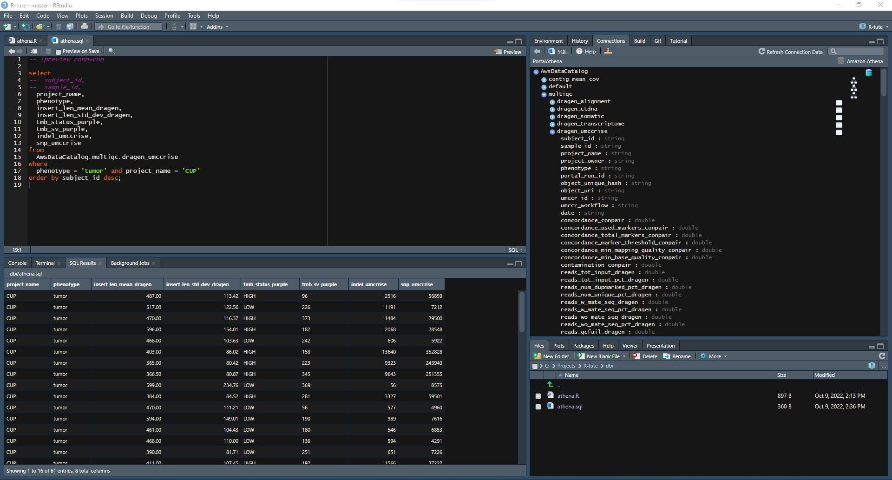
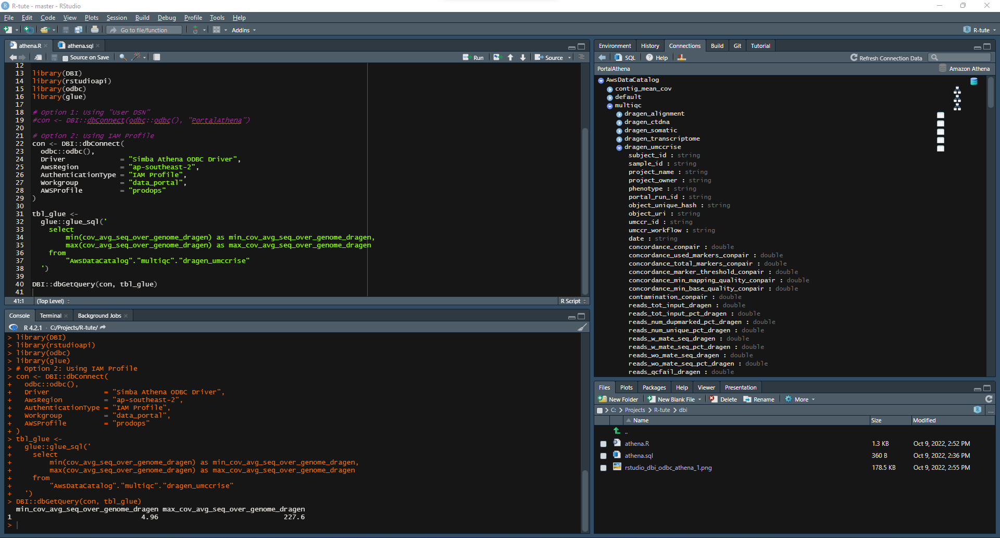
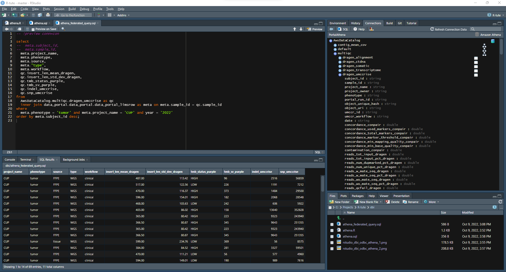
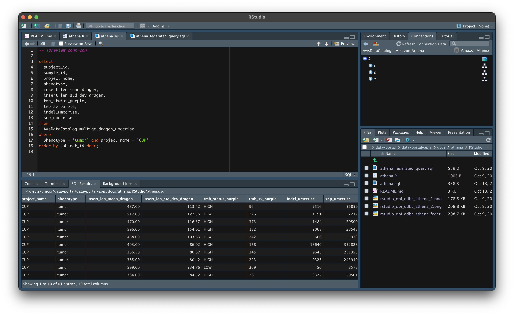

# Portal Athena with RStudio

This shows how to use _RStudio IDE as R/SQL Client_ with Portal AWS Athena setup. 

This uses [R-DBI library](https://dbi.r-dbi.org) through ODBC connection to Athena. If this does not work, please see [CLI](../README_CLI.md) or [Programmatic section](../README.md) for alternate.


## Setup

### Step 1

- Download and install "**Simba Athena ODBC Driver**" from AWS[1]

### Step 2

- Login UMCCR AWS Prod account as `ProdOperator` as usual

```
aws sso login --profile prodops
yawsso -p prodops
```

### Step 3

- Create R script file, e.g. `athena.R`
- As in [2], construct `con` DBI connection object in regard to UMCCR AWS profile.

```
con <- DBI::dbConnect(
  odbc::odbc(),
  Driver             = "Simba Athena ODBC Driver",
  AwsRegion          = "ap-southeast-2",
  AuthenticationType = "IAM Profile",
  Workgroup          = "data_portal",
  AWSProfile         = "prodops"
)
```

### Step 4

- Create SQL script file, e.g. `athena.sql`
- Use SQL comment macro in `.sql` file with reference to `con` connection object created from step 2. RStudio will render result table in preview panel. e.g.

```sql
-- !preview conn=con

select count(1) from "AwsDataCatalog"."multiqc"."dragen_umccrise";
```

- You can also use more programmatic way with R through `glue` or `dbplyr` then `ggplot2`. 

- See [3] for more details.


## MacOS

> If you are on macOS, you may need the following additional steps.

- Update Simba ODBC config file to match as follows.

```
sudo vi /Library/simba/athenaodbc/lib/simba.athenaodbc.ini
```

```
[Driver]
## - Note that this default DriverManagerEncoding of UTF-32 is for iODBC.
ErrorMessagesPath=/Library/simba/athenaodbc/ErrorMessages
LogLevel=0
LogPath=
SwapFilePath=/tmp
Driver=/Library/simba/athenaodbc/lib/libathenaodbc_sb64.dylib
ODBCInstLib=/usr/local/lib/libodbcinst.dylib
```

- Install [unixODBC](http://www.unixodbc.org)

```
brew install unixodbc
```

- List unixODBC config file locations

```
odbcinst -j

  unixODBC 2.3.11
  DRIVERS............: /usr/local/etc/odbcinst.ini
  SYSTEM DATA SOURCES: /usr/local/etc/odbc.ini
  FILE DATA SOURCES..: /usr/local/etc/ODBCDataSources
  USER DATA SOURCES..: /Users/<username>/.odbc.ini
  SQLULEN Size.......: 8
  SQLLEN Size........: 8
  SQLSETPOSIROW Size.: 8
```

- Update unixODBC config file to match as follows. 

```
vi /usr/local/etc/odbcinst.ini
```

```
[Simba Athena ODBC Driver]
Driver=/Library/simba/athenaodbc/lib/libathenaodbc_sb64.dylib
```

- See [4] [5] for additional resources.

## Starter Demo

### Scripts

- [athena.R](athena.R)
- [athena.sql](athena.sql)
- [athena_federated_query.sql](athena_federated_query.sql)

### Windows







### MacOS



## REF

* [1] https://docs.aws.amazon.com/athena/latest/ug/connect-with-odbc.html
* [2] https://solutions.rstudio.com/db/databases/athena/
* [3] https://www.rstudio.com/blog/working-with-databases-and-sql-in-rstudio/
* [4] https://exploratory.io/note/exploratory/How-to-use-Amazon-Athena-ODBC-Driver-on-Mac-UtO9zcN7
* [5] https://github.com/r-dbi/odbc
