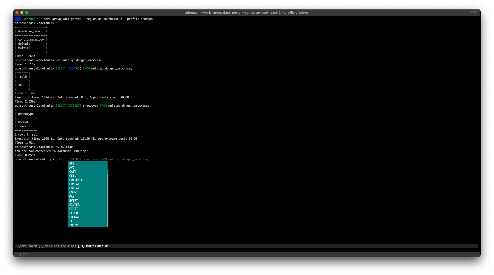

# Portal Athena with athenacli

> NOTE: 
> * This is for using SQL client / REPL shell for Athena from https://github.com/dbcli/athenacli
> * If you prefer simplicity, use AWS CLI wrap around with Bash script. See [README_CLI.md](../README_CLI.md)

## Quickstart

### 1. Install

```
brew install athenacli
```

### 2. Login AWS as usual

```
aws sso login --profile prodops
yawsso -p prodops
```

### 3. Connect it
```
athenacli --work_group data_portal --region ap-southeast-2 --profile prodops
```

## Basic

```
ap-southeast-2:default> \?
+-------------+----------------------------+------------------------------------------------------------+
| Command     | Shortcut                   | Description                                                |
+-------------+----------------------------+------------------------------------------------------------+
| \G          | \G                         | Display current query results vertically.                  |
| \dt         | \dt [table]                | List or describe tables.                                   |
| \e          | \e                         | Edit command with editor (uses $EDITOR).                   |
| \f          | \f [name [args..]]         | List or execute favorite queries.                          |
| \fd         | \fd [name]                 | Delete a favorite query.                                   |
| \fs         | \fs name query             | Save a favorite query.                                     |
| \l          | \l                         | List databases.                                            |
| \once       | \o [-o] filename           | Append next result to an output file (overwrite using -o). |
| \timing     | \t                         | Toggle timing of commands.                                 |
| download    | download                   | Download results from last query.                          |
| exit        | \q                         | Exit.                                                      |
| help        | \?                         | Show this help.                                            |
| nopager     | \n                         | Disable pager, print to stdout.                            |
| notee       | notee                      | Stop writing results to an output file.                    |
| pager       | \P [command]               | Set PAGER. Print the query results via PAGER.              |
| prompt      | \R                         | Change prompt format.                                      |
| quit        | \q                         | Quit.                                                      |
| read        | read [filename]            | Read and execute query from a file.                        |
| system      | system [command]           | Execute a system shell commmand.                           |
| tableformat | \T                         | Change the table format used to output results.            |
| tee         | tee [-o] filename          | Append all results to an output file (overwrite using -o). |
| use         | \u                         | Change to a new database.                                  |
| watch       | watch [seconds] [-c] query | Executes the query every [seconds] seconds (by default 5). |
+-------------+----------------------------+------------------------------------------------------------+
Time: 0.010s

ap-southeast-2:default> \l
+-----------------+
| database_name   |
+-----------------+
| contig_mean_cov |
| default         |
| multiqc         |
+-----------------+
Time: 1.177s

ap-southeast-2:default> \u multiqc
You are now connected to database "multiqc"
Time: 0.051s

ap-southeast-2:default> \q
```

## REPL Prompt

> More https://github.com/dbcli/athenacli/blob/main/docs/features.rst




## Read Script

This use case is great for a more routine data summarization task; like Unix `top` process view but a specific database table view with selected metrics and aggregation!

```
ap-southeast-2:multiqc> read dragen_ctdna_qc_by_project.sql;
Time: 3.350s
```

```
-- Get DRAGEN ctDNA QC metrics by Project aggregate
--
-- It is recommended to use full path for table FROM clause
-- e.g. AwsDataCatalog.multiqc.dragen_ctdna

select project_name, project_owner,
    round(avg(reads_tot_input_dragen)) as reads,
    round(avg(insert_len_mean_dragen)) as insert_size,
    round(avg(reads_num_dupmarked_pct_dragen)) as dup,
    round(avg(reads_qcfail_pct_dragen)) as fail,
    round(avg(reads_mapped_pct_dragen)) as mapped,
    round(avg(bases_q30_dragen)) as q30,
    round(avg(bases_q30_pct_dragen)) as q30_perc
from AwsDataCatalog.multiqc.dragen_ctdna
group by project_name, project_owner
+--------------------+---------------+--------------+-------------+-----+------+--------+----------------+----------+
| project_name       | project_owner | reads        | insert_size | dup | fail | mapped | q30            | q30_perc |
+--------------------+---------------+--------------+-------------+-----+------+--------+----------------+----------+
| Validation         | UMCCR         | 1009323397.0 | 157.0       | 0.0 | 0.0  | 98.0   | 129036601355.0 | 93.0     |
| Validation,Control | UMCCR         | 1050518975.0 | 160.0       | 0.0 | 0.0  | 99.0   | 136245953903.0 | 93.0     |
| PO                 | VCCC          | 1098689254.0 | 166.0       | 0.0 | 0.0  | 99.0   | 144896804621.0 | 93.0     |
| CUP                | Tothill       | 1081780737.0 | 160.0       | 0.0 | 0.0  | 99.0   | 141921952066.0 | 93.0     |
| Research           | Buchanan      | 965174084.0  | 166.0       | 0.0 | 0.0  | 97.0   | 123722894558.0 | 92.0     |
+--------------------+---------------+--------------+-------------+-----+------+--------+----------------+----------+
```

Alternatively,

```
athenacli \
    --work_group data_portal \
    --region ap-southeast-2 \
    --profile prodops \
    -e dragen_ctdna_qc_by_project.sql
```

```
athenacli \
    --work_group data_portal \
    --region ap-southeast-2 \
    --profile prodops \
    -e dragen_ctdna_qc_by_project.sql > dragen_ctdna_qc_by_project.csv
```

However. For a better, lager data extraction job, it is recommended to use [README_CLI.md](../README_CLI.md) or Athena Console.
