# Portal Pipeline Automation v1

This is v1 documentation of fully automated pipeline and workflows orchestration. i.e. Automation of [BioInformatics CWL workflow](https://github.com/umccr/cwl-ica) runs in ICA (Illumina Connected Analytics) WES (Workflow Execution Service) and AWS Batch (such as [NextFlow NFCore stack](https://github.com/umccr/nextflow-stack)). 

## TL;DR

- See [cleanup](cleanup) for pipeline failure, cleanup and rerun SOP.
- See [automation](automation) for operational notes.
- See [metadata.md](metadata.md) for syncing upstream Metadata.

## Concept

The following depicts a simplified process diagram ([automated_pipeline.svg](../model/automated_pipeline.svg) | [automated_pipeline.png](../model/automated_pipeline.png)) of main steps in the pipeline automation.

The current automation is centered around (workflow) events, i.e. actions are triggered by previous actions/events. As such particular workflows/steps can be triggered by replaying external events.

Refer architecture and code design doc ([architecture_code_design.pdf](../model/architecture_code_design.pdf)) for some background.

Automation entry-points are cloud-native serverless AWS Lambda compute unit -- an event controller. These controllers are event-driven and react to events delivered from ICA ENS or AWS Batch event subscription through SQS. These lambdas can be seen as job/event consumers of a particular queue. Multiple entry-points to automation is possible and intended design.

A central Orchestrator receives most external events and performs 2 simple tasks: 
1. update step
2. next step

This works like in feedback loop tandem such that:

- In each update step for a given workflow run, orchestrator perform updating _this_ workflow automation state in database.
- Then, it determines next step based on _this_ workflow status and invoke _step module_ perform interface method.
- **Step module** is Job Producer and, it produces a job (or job list) into their respective (internal) queue.
- Job (internal) queues are FIFO and deduplication by message content.
