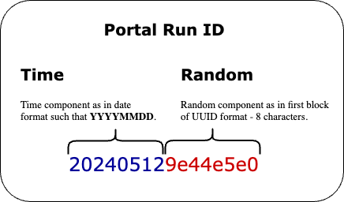

# Portal Run ID

You may come across people mentioning this term. The following document explains its attributes, property, constraint rule and use cases that it intends to solve.

## Curation

### Where would you encounter?

Often written as `portal_run_id` in Portal UI, [API endpoints](../ENDPOINTS.md) or data export from Portal database through [Portal Athena](../athena) or via meeting/Slack/Trello communication. This ID keeps track of every bioinformatics analysis run; also known as a "workflow run" for short. You may encounter this ID scheme when someone is referring to analysis output for traceability with the Portal ecosystem.

### Unit of work

It is designed in mind such that:
- Every bioinformatics analysis run is immutable and a single unit of work transaction
- Every bioinformatics analysis run gets assigned one unique `portal_run_id`
  - re-running the same type of analysis for the same Sample will also result in a different unique ID
- Each analysis run must meet a terminal state such as `Failed`, `Aborted`, `Succeeded`, or `Deleted`

A typical bioinformatics workflow (languages like [CWL](https://www.commonwl.org), [WDL](https://openwdl.org), [Nextflow](https://www.nextflow.io), [Snakemake](https://github.com/snakemake/snakemake)) consists of multiple steps or tasks. A Portal orchestration views one analysis workflow run as a single unit of work transaction and this workflow must either be completed successfully or otherwise failed.

A workflow can be as simple or as complex as its author wishes (e.g. containing simple tasks or entire subworkflows). Regardless, the Portal orchestration engine takes a single workflow run as one unit of work item that must meet terminal condition without tampering the workflow execution run, _in-flight_.

### History

A deletion marker happens on the `portal_run_id` database record when the analysis run outcome is found to be unfit for scientific curation by post bioinformatics analysis quality control process. When a deletion request happens, the following Portal SOP will be carried out:
- Update the corresponding `portal_run_id` status in Portal database to `Deleted`
- Delete the associated bioinformatics analysis results (artifacts such as HTML, PDF reports, CSV/TSV, VCF, BAM, etc.) from the data storage (Cloud Object Store such as AWS S3)

Since the Portal never deletes "the contextual fact" about a bioinformatics analysis run that has been performed, by knowing the `portal_run_id` (even if it has a deletion marker or a soft-deletion marker), the Portal can answer the input and output of the analysis run at all times. This gives the analysis run history by design for audit trail.

## Bioinformatics

### Construct



_Permalink to image: [`docs/model/portal_run_id.png`](../model/portal_run_id.png)_

The `portal_run_id` consists of two parts: **time component** and **random component**. It has a total length of fixed size `16` characters. The ID construct algorithm is as follows.

**Step 1**: Generate datestamp in `YYYYMMDD` format in UTC
```bash
$ date -u +"%Y%m%d"
20240512
```

**Step 2**: Generate UUID and get the first 8 characters block
```bash
uuidgen | cut -c 1-8
9e44e5e0
```

**Step 3**: Concatenation of the two components form the `portal_run_id`
```
202405129e44e5e0
```

**Justification**: The reasons why we do this ID construct scheme are as follows:
- **User Understanding**: The ID design aims to ensure that end users can easily comprehend the analysis run date associated with it.
- **Global Uniqueness**: The ID must be globally unique within the context of the portal ecosystem.
- **Formula-Based Generation**: It is a formula-based ID, allowing it to be generated outside the portal with common command-line tools.
- **Distributed Workload Handling**: The ID is designed to handle analysis run workloads in a distributed fashion (explained below).

### In-Band and Out-of-Band

When bioinformatics analysis runs are launched through the Portal (exposed as AWS Lambda functions calling [entrypoints](automation)), the Portal internally assigns the `portal_run_id` to start tracking of the analysis run. This use case is called "In-Band". The Portal Automation then knows how to update the corresponding workflow run and what to trigger next based on best practise bioinformatics runbook **rules** that it has coded into the system.

The "Out-of-Band" analysis runs happen outside the Portal Automation. Typical use cases are preparing large cohort (re)analyses. We request the bioinformatician to generate and assign every analysis workflow run execution to have one unique `portal_run_id`, including failed ones. This `portal_run_id` may have corresponding execution ID where the analysis gets computed. For instance, if the workflow runs:

- on AWS Batch execution engine, you have a pair of `portal_run_id` and AWS Batch execution ID.
- on AWS StepFunction, you have a pair of `portal_run_id` and AWS StepFunction execution ID.
- on ICA WES (workflow execution service), you get `portal_run_id` and corresponding `wfr.<ID>`.
- on HPC systems (such Gadi, Spartan), you get `portal_run_id` and your Job ID (PBS, or queuing scheduler system).

So on so forth.

Every execution of a workflow, you must generate a unique `portal_run_id` and keep the record of corresponding execution ID from the underlying compute system. _This can even be on your local computer execution!_ (explain next)

### Output Path

As for Bioinformatician (as well as) anyone who performs the bioinformatics analysis run, one should use this `portal_run_id` in the workflow result output path. Example:

```bash
/scratch/runs/wgs_tumor_normal/202405129e44e5e0/
file://scratch/runs/wgs_tumor_normal/202405129e44e5e0/
s3://scratch-bucket/runs/wgs_tumor_normal/202405129e44e5e0/
gds://scratch-volume/runs/wgs_tumor_normal/202405129e44e5e0/
icav2://scratch-project/runs/wgs_tumor_normal/202405129e44e5e0/
```

Once the analysis run has been concluded, we can drive the results back; enter into the Portal Pipeline database for traceability and/or further data warehousing purpose. Often, this process needs to comply with Portal [Metadata](metadata.md).

In summary, the `portal_run_id` is formula-based and systematic scheme for herding the analysis run records into the Portal Pipeline database either with "out-of-band" process or automated tracking process, so that one person (or a system event) would start the analysis without the wait and, still be consistent by following standard operation procedure (SOP) and best practises.
