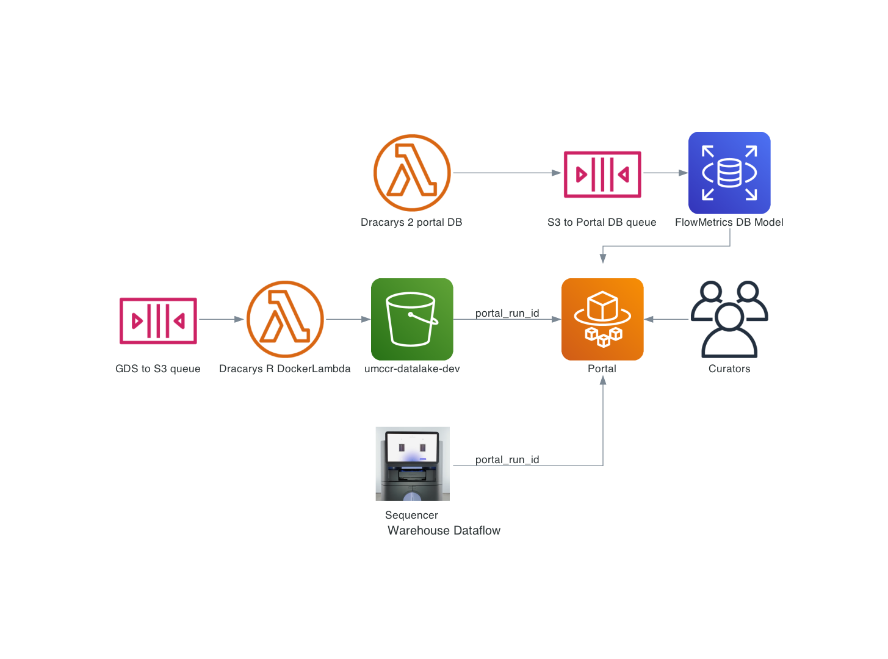

# UMCCR Warehouse

This is a brief explainer about the different facets of the UMCCR data portal.



The diagram above can be programmatically regenerated via:

```
pip install diagrams
python warehouse_dataflow.py
```

Files consumed from Illumina's GDS storage are cleaned up by Dracarys and stored on S3 under the following prefix:

s3://umccr-datalake-dev/portal/creation_date=2023-03-17/

Where the `creation_date` prefix is used for Athena partitioning purposes. Other third party systems like DataBricks can also consume from this common source.

A noteworthy detail is that `portal` is a prefix for data especifically curated for the data portal models. In the future, more "raw" prefixes such as `warehouse` might appear to appease bigger data needs and usecases that do not require a curated data model as the data portal (and its underlying Django ORM models) do.
